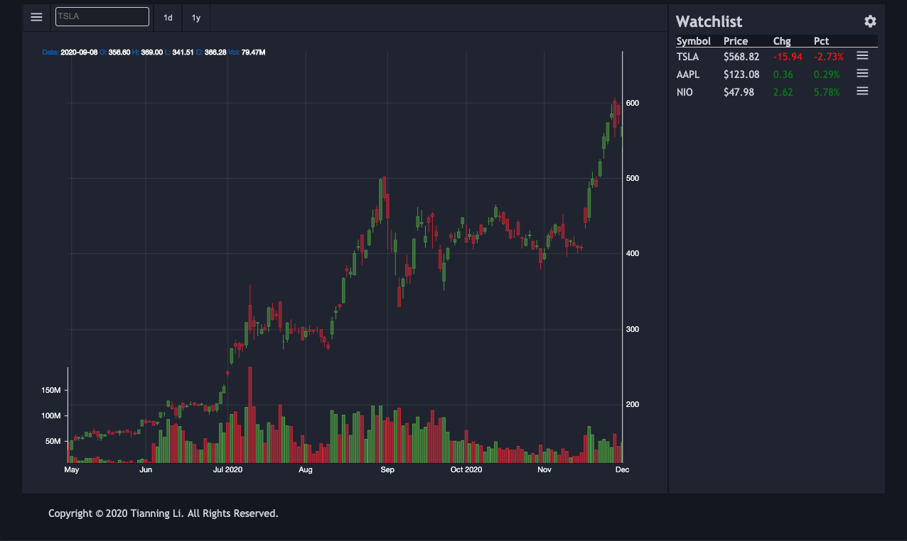

# Stock_Market_App
Full Stack web develop for getting stock information.

- api: Using Django REST framework to handle data include getting stock history and market information.
- frontend: Using React.js to display the frontend website for display.

## API
| HTTP Method | URI | Action| Sample Request Data |
| ------------- | ------------- | ------------- | ------------- |
| POST | http://[hostname]/api/ | Getting single stock history | {"tickers": ["TSLA"], "interval": "1d", "period":"5d","market": "history", "data_format": "v2" } |
| POST | http://[hostname]/api/ | Getting stocks market value | {"tickers": ["TSLA","NIO"], "interval": "1d", "period":"5d", "market": "current"} |

## Frontend Display

